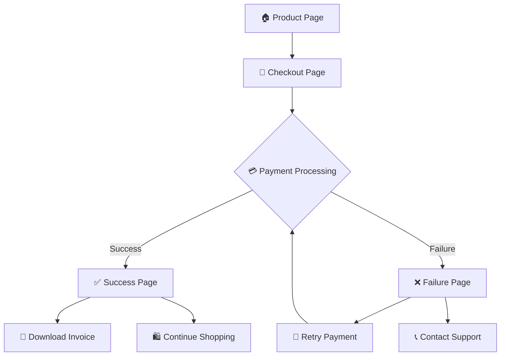

# 🏃‍♂️ SportMax Store - Product Payment Experience

<div align="center">
  
  
  **A modern, responsive e-commerce frontend for premium footwear with integrated payment flow**
  
  
  
  
  

</div>

---

## 🌟 Overview

SportMax Store is a complete frontend implementation of a modern e-commerce product purchase experience featuring premium running shoes. Built with Next.js 15, TypeScript, and Tailwind CSS, it provides a seamless shopping flow from product discovery to payment completion.

### ✨ What Makes It Special

- **🎨 Modern UI/UX**: Beautiful gradients, smooth animations, and responsive design
- **⚡ Interactive Elements**: Real-time size/color selection with visual feedback
- **💳 Payment Integration**: Frontend-ready for Razorpay and Paytm integration
- **📱 Mobile-First**: Optimized for all screen sizes and devices
- **🔒 Secure Flow**: Complete payment simulation with success/failure handling

---

## 🎯 Features

### 🛍️ Product Experience
- **Product Showcase**: High-quality product display with interactive image gallery
- **Size & Color Selection**: Interactive size and color picker with visual feedback
- **Rating System**: 5-star rating display with customer reviews
- **Price Display**: Dynamic pricing with discount calculations and savings highlight
- **Product Details**: Comprehensive specifications and feature listings

### 💰 Payment Flow
- **Customer Data Collection**: Form validation for name, age, mobile, and email
- **Payment Options**: Support for Razorpay and Paytm payment gateways
- **Order Processing**: Real-time payment simulation with loading states
- **Success Handling**: Detailed order confirmation with invoice download
- **Failure Recovery**: Error handling with retry options and support information

### 🎨 Design & UX
- **Gradient Backgrounds**: Beautiful color gradients throughout the interface
- **Smooth Animations**: Hover effects, transitions, and micro-interactions
- **Responsive Layout**: Mobile-first design that works on all devices
- **Modern Typography**: Clean, readable fonts with proper hierarchy
- **Accessibility**: Proper ARIA labels and keyboard navigation support

---

## 📱 Pages & Flow



### 🏠 Product Page (`/`)
- Interactive product showcase with zoom effects
- Size and color selection with real-time updates
- Detailed product information and specifications
- Prominent "Buy Now" call-to-action button

### 🛒 Checkout Page (`/checkout`)
- Customer information form with validation
- Order summary with product details
- Payment method selection (Razorpay/Paytm)
- Secure payment processing simulation

### ✅ Success Page (`/success`)
- Order confirmation with details
- Invoice download functionality
- Expected delivery information
- Continue shopping options

### ❌ Failure Page (`/failure`)
- Error details and troubleshooting tips
- Payment retry options
- Customer support contact information
- Order modification capabilities

---

## 🛠️ Technology Stack

| Technology | Version | Purpose |
|------------|---------|---------|
| **Next.js** | 15.4.1 | React framework with App Router |
| **TypeScript** | 5.0+ | Type-safe JavaScript development |
| **Tailwind CSS** | 4.0 | Utility-first CSS framework |
| **React** | 19.1.0 | UI library for building interfaces |
| **Node.js** | 18+ | JavaScript runtime environment |

### 🎨 Design System
- **Colors**: Blue and purple gradients with neutral grays
- **Typography**: Geist Sans and Geist Mono fonts
- **Spacing**: Consistent 8px grid system
- **Shadows**: Layered shadow system for depth
- **Animations**: Smooth transitions and hover effects

---

## 🚀 Installation

### Prerequisites
- **Node.js** 18.0 or higher
- **npm** 8.0 or higher (or yarn/pnpm)
- **Git** for version control

### Quick Start

1. **Clone the repository**
   ```bash
   git clone https://github.com/yourusername/sportmax-store.git
   cd sportmax-store
   ```

2. **Install dependencies**
   ```bash
   npm install
   # or
   yarn install
   # or
   pnpm install
   ```

3. **Start development server**
   ```bash
   npm run dev
   # or
   yarn dev
   # or
   pnpm dev
   ```

4. **Open in browser**
   ```
   http://localhost:3000
   ```

### 🏗️ Build for Production

```bash
# Build the application
npm run build

# Start production server
npm start
```

---

## 📁 Project Structure

```
sportmax-store/
├── 📁 public/
│   ├── shoe-image.svg          # Product images
│   └── [other assets]
├── 📁 src/
│   └── 📁 app/
│       ├── 📄 page.tsx         # Product showcase page
│       ├── 📄 layout.tsx       # Root layout component
│       ├── 📄 globals.css      # Global styles
│       ├── 📄 not-found.tsx    # 404 error page
│       ├── 📁 checkout/
│       │   └── 📄 page.tsx     # Checkout form page
│       ├── 📁 success/
│       │   └── 📄 page.tsx     # Payment success page
│       └── 📁 failure/
│           └── 📄 page.tsx     # Payment failure page
├── 📄 package.json             # Dependencies and scripts
├── 📄 tailwind.config.ts       # Tailwind configuration
├── 📄 tsconfig.json           # TypeScript configuration
├── 📄 next.config.ts          # Next.js configuration
└── 📄 README.md               # Project documentation
```

---

## 🎮 Demo & Usage

### 🛍️ Shopping Flow

1. **Browse Product**: View the premium running shoes with detailed information
2. **Select Options**: Choose your preferred size and color
3. **Add to Cart**: Click "Buy Now" to proceed to checkout
4. **Enter Details**: Fill in customer information (name, age, mobile, email)
5. **Choose Payment**: Select Razorpay or Paytm as payment method
6. **Complete Purchase**: Experience simulated payment processing
7. **View Results**: Success page with invoice or failure page with retry options

### 💳 Payment Simulation

The application simulates real payment processing:
- **Success Rate**: 70% for initial attempts, 80% for retries
- **Processing Time**: 3-second simulation with loading animation
- **Data Persistence**: Order details stored in localStorage
- **Error Handling**: Comprehensive failure scenarios with recovery options

---

## 🔧 Configuration

### Environment Variables
Create a `.env.local` file for configuration:

```env
# App Configuration
NEXT_PUBLIC_APP_NAME=SportMax Store
NEXT_PUBLIC_APP_URL=http://localhost:3000

# Payment Gateway URLs (for future integration)
NEXT_PUBLIC_RAZORPAY_KEY=your_razorpay_key
NEXT_PUBLIC_PAYTM_MID=your_paytm_merchant_id
```

### Tailwind Configuration
The project uses a custom Tailwind configuration with:
- Extended color palette
- Custom animations
- Responsive breakpoints
- Typography scale

---

## 🚀 Deployment

### Vercel (Recommended)
```bash
# Install Vercel CLI
npm i -g vercel

# Deploy to Vercel
vercel
```

### Netlify
```bash
# Build the project
npm run build

# Deploy to Netlify
# Upload the `out` folder to Netlify
```

### Docker
```dockerfile
FROM node:18-alpine
WORKDIR /app
COPY package*.json ./
RUN npm install
COPY . .
RUN npm run build
EXPOSE 3000
CMD ["npm", "start"]
```

---

## 🔮 Future Enhancements

### 📋 Roadmap
- [ ] **Real Payment Integration**: Implement actual Razorpay/Paytm SDKs
- [ ] **User Authentication**: Add login/signup functionality
- [ ] **Product Catalog**: Expand to multiple products and categories
- [ ] **Shopping Cart**: Multi-item cart with quantity management
- [ ] **Order Tracking**: Real-time order status updates
- [ ] **Reviews System**: Customer review and rating functionality
- [ ] **Wishlist**: Save favorite products for later
- [ ] **Admin Panel**: Product and order management interface

### 🛠️ Technical Improvements
- [ ] **State Management**: Redux or Zustand for complex state
- [ ] **API Integration**: Backend API for data management
- [ ] **Testing**: Unit and integration tests with Jest/Cypress
- [ ] **Performance**: Image optimization and lazy loading
- [ ] **SEO**: Enhanced meta tags and structured data
- [ ] **PWA**: Progressive Web App capabilities

---

## 🤝 Contributing

We welcome contributions! Please follow these steps:

1. **Fork the repository**
2. **Create a feature branch**: `git checkout -b feature/amazing-feature`
3. **Commit changes**: `git commit -m 'Add amazing feature'`
4. **Push to branch**: `git push origin feature/amazing-feature`
5. **Open a Pull Request**

### 📝 Coding Standards
- Use TypeScript for all new code
- Follow ESLint and Prettier configurations
- Write meaningful commit messages
- Add proper documentation for new features

---

## 📞 Support

### 🐛 Issues & Bugs
If you encounter any issues, please [create an issue](https://github.com/yourusername/sportmax-store/issues) with:
- Detailed description of the problem
- Steps to reproduce
- Expected vs actual behavior
- Screenshots if applicable

### 💬 Contact
- **Email**: support@sportmax.com
- **Phone**: +91 98765 43210
- **GitHub**: [@yourusername](https://github.com/yourusername)

---

## 📄 License

This project is licensed under the MIT License - see the [LICENSE](LICENSE) file for details.

---

## 🙏 Acknowledgments

- **Next.js Team** for the amazing framework
- **Tailwind CSS** for the utility-first CSS framework
- **Vercel** for hosting and deployment platform
- **React Team** for the UI library
- **TypeScript Team** for type safety

---

<div align="center">
  <p>Made with ❤️ by <strong>Your Name</strong></p>
  <p>⭐ Star this repo if you found it helpful!</p>
  
  [](https://github.com/yourusername/sportmax-store/stargazers)
  [](https://github.com/yourusername/sportmax-store/network/members)
  [](https://github.com/yourusername/sportmax-store/issues)
</div>
