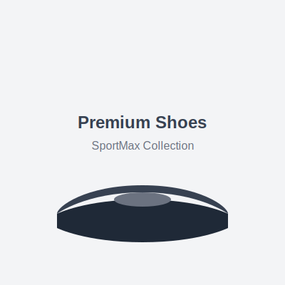
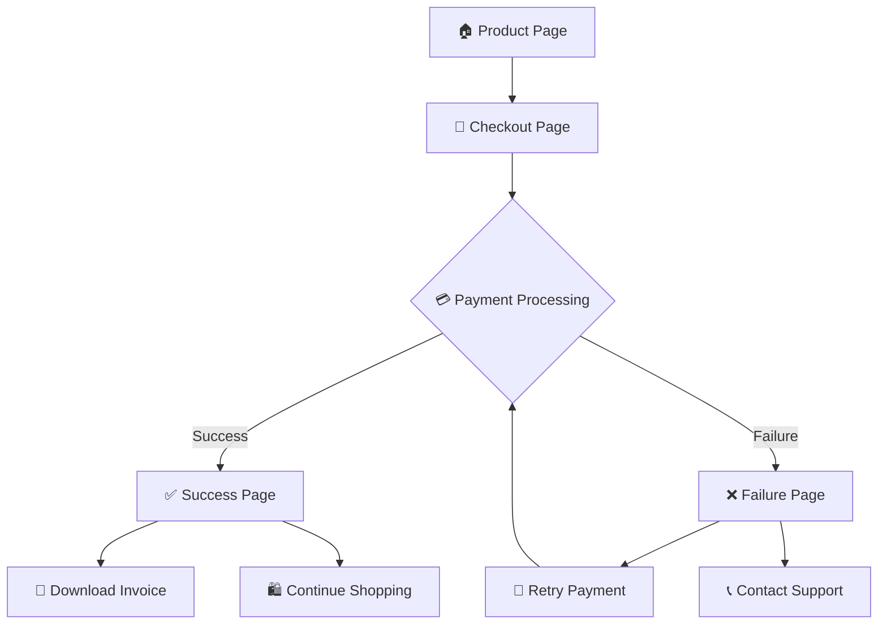

# 🏃‍♂️ SportMax Store - Product Payment Experience

  
  
  **A modern, responsive e-commerce frontend for premium footwear with integrated payment flow**
  
  
  
  
  

---

## 🌟 Overview

SportMax Store is a complete frontend implementation of a modern e-commerce product purchase experience featuring premium running shoes. Built with Next.js 15, TypeScript, and Tailwind CSS, it provides a seamless shopping flow from product discovery to payment completion.

### ✨ What Makes It Special

- **🎨 Modern UI/UX**: Beautiful gradients, smooth animations, and responsive design
- **⚡ Interactive Elements**: Real-time size/color selection with visual feedback
- **💳 Payment Integration**: Frontend-ready for Razorpay and Paytm integration
- **📱 Mobile-First**: Optimized for all screen sizes and devices
- **🔒 Secure Flow**: Complete payment simulation with success/failure handling

---

## 🎯 Features

### 🛍️ Product Experience
- **Product Showcase**: High-quality product display with interactive image gallery
- **Size & Color Selection**: Interactive size and color picker with visual feedback
- **Rating System**: 5-star rating display with customer reviews
- **Price Display**: Dynamic pricing with discount calculations and savings highlight
- **Product Details**: Comprehensive specifications and feature listings

### 💰 Payment Flow
- **Customer Data Collection**: Form validation for name, age, mobile, and email
- **Payment Options**: Support for Razorpay and Paytm payment gateways
- **Order Processing**: Real-time payment simulation with loading states
- **Success Handling**: Detailed order confirmation with invoice download
- **Failure Recovery**: Error handling with retry options and support information

### 🎨 Design & UX
- **Gradient Backgrounds**: Beautiful color gradients throughout the interface
- **Smooth Animations**: Hover effects, transitions, and micro-interactions
- **Responsive Layout**: Mobile-first design that works on all devices
- **Modern Typography**: Clean, readable fonts with proper hierarchy
- **Accessibility**: Proper ARIA labels and keyboard navigation support

---

## 📱 Pages & Flow

### 🏠 Product Page (`/`)
- Interactive product showcase with zoom effects
- Size and color selection with real-time updates
- Detailed product information and specifications
- Prominent "Buy Now" call-to-action button

### 🛒 Checkout Page (`/checkout`)
- Customer information form with validation
- Order summary with product details
- Payment method selection (Razorpay/Paytm)
- Secure payment processing simulation

### ✅ Success Page (`/success`)
- Order confirmation with details
- Invoice download functionality
- Expected delivery information
- Continue shopping options

### ❌ Failure Page (`/failure`)
- Error details and troubleshooting tips
- Payment retry options
- Customer support contact information
- Order modification capabilities

---

## 🛠️ Technology Stack

| Technology | Version | Purpose |
|------------|---------|---------|
| **Next.js** | 15.4.1 | React framework with App Router |
| **TypeScript** | 5.0+ | Type-safe JavaScript development |
| **Tailwind CSS** | 4.0 | Utility-first CSS framework |
| **React** | 19.1.0 | UI library for building interfaces |
| **Node.js** | 18+ | JavaScript runtime environment |

### 🎨 Design System
- **Colors**: Blue and purple gradients with neutral grays
- **Typography**: Geist Sans and Geist Mono fonts
- **Spacing**: Consistent 8px grid system
- **Shadows**: Layered shadow system for depth
- **Animations**: Smooth transitions and hover effects

---

## 📄 License

This project is licensed under the MIT License - see the [LICENSE](LICENSE) file for details.

---
